# TODO List App

Welcome to the TODO List App! This application helps you create customized task lists and manage them efficiently with various features like color customization, date selection, swipe-to-dismiss, and sorting.

## Features

- **Customized Task Tiles**: Create task tiles that can be customized with different colors.
- **Date Selection**: Assign specific dates to each task.
- **Swipe to Dismiss**: Easily swipe tasks to delete them.
- **Sort Menu**: Sort tasks by status of task.
- **User-friendly Interface**: Simple and intuitive design for easy task management.

## Screenshots

Onboarding Screen
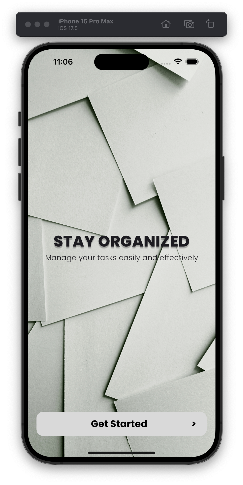

Register Screen
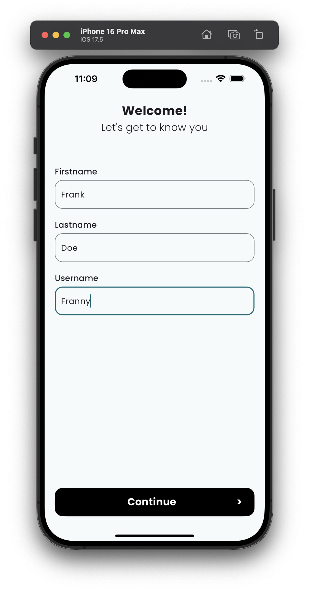

TODO Screen
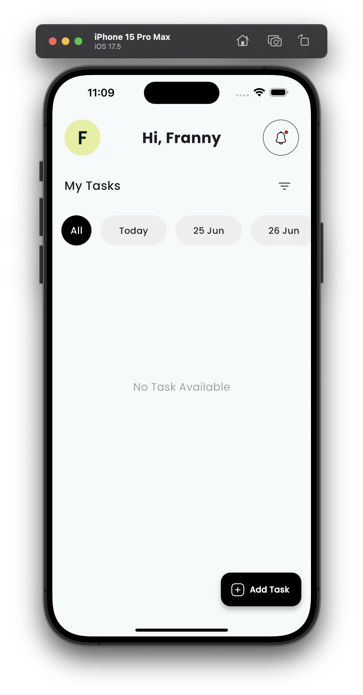

Add Task Screen
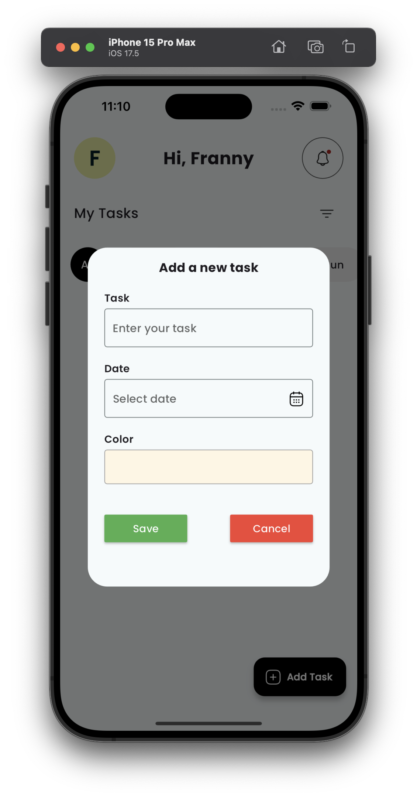

DatePicker
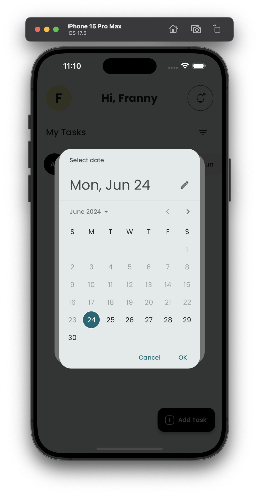

ColorPicker
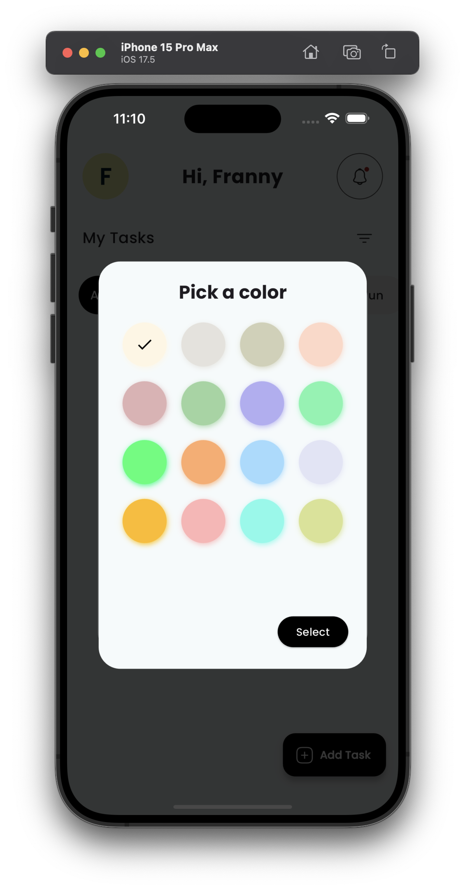

Tasks Added
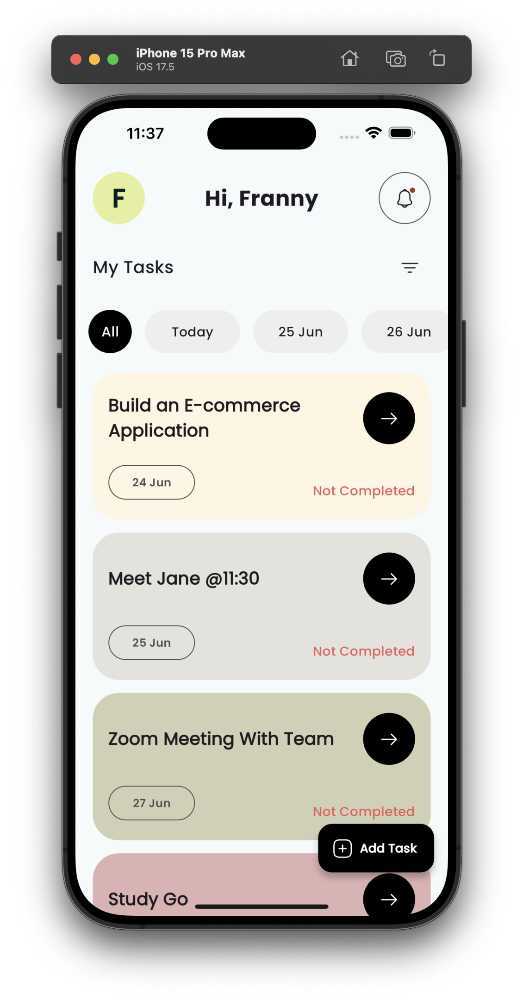

Tasks Status Update
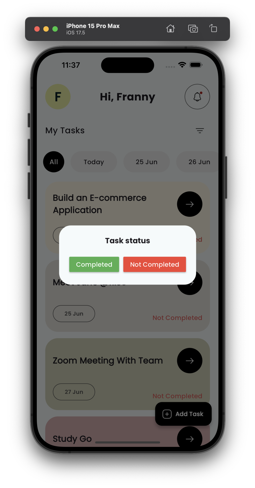

Tasks Status Updated
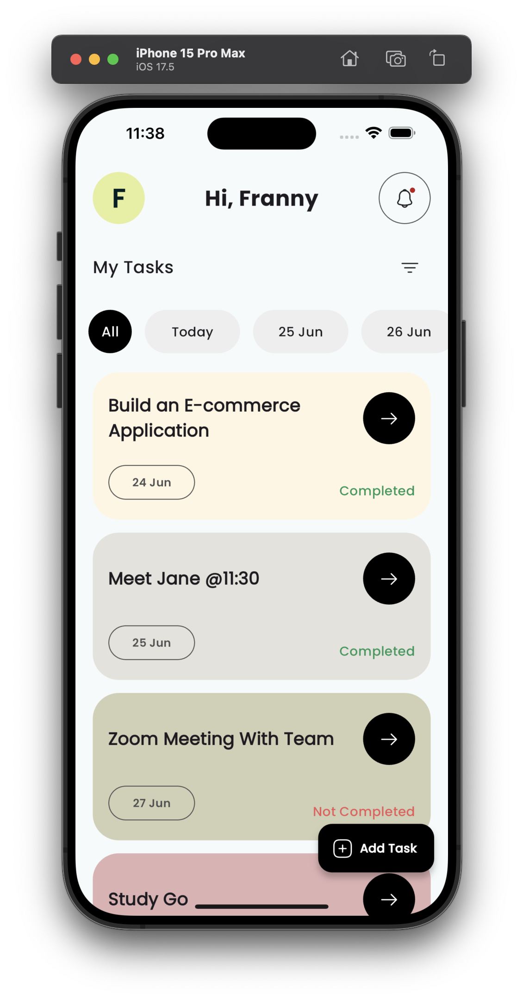

Tasks Ondismiss
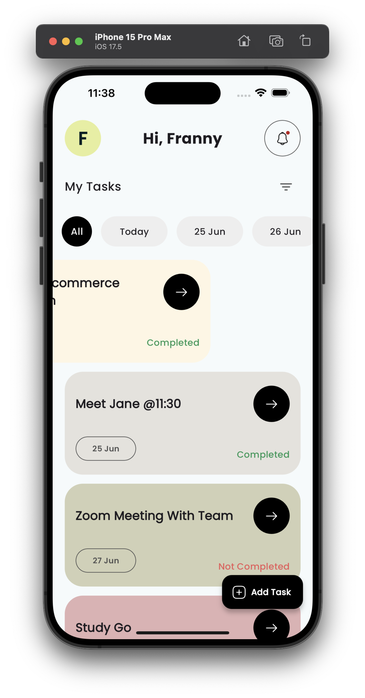

Tasks Ondismissed
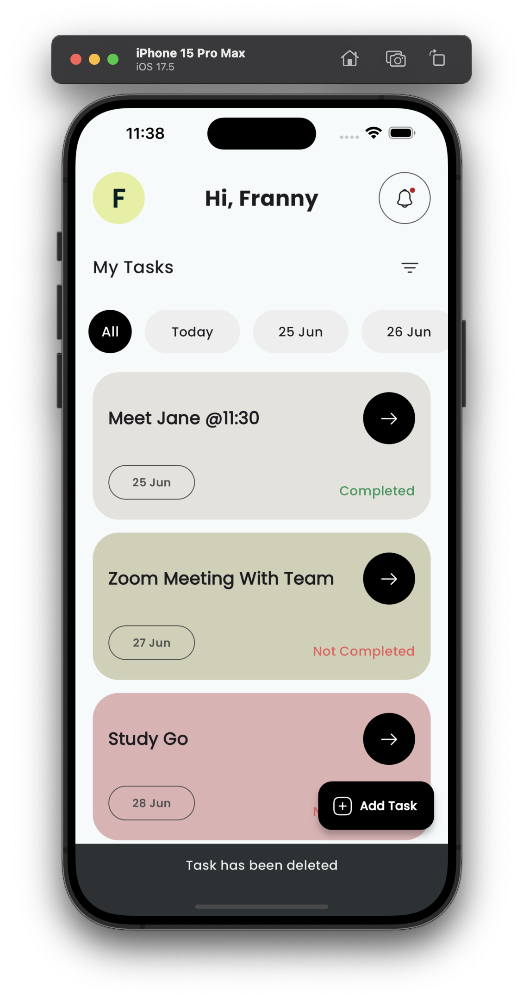

Tasks Sort Menu
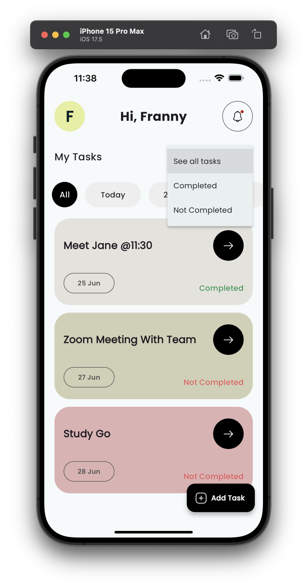

Tasks Sorted
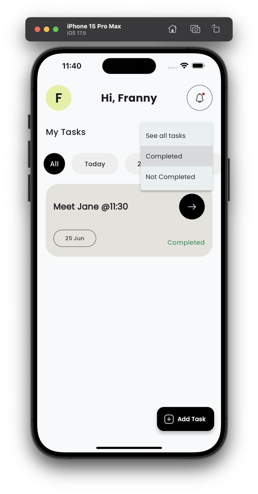
